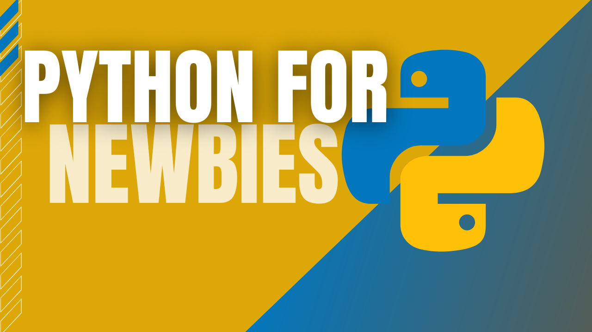

# Python for Newbies

A Beginner's Guide to Python, to enable people to code and make DIY Projects, taught through short video tutorials on YouTube, with simple learning projects.

## Course Playlist

## View Lesson Plan

[Lesson Plan](Lesson%20Plan/README.md)

## Prerequisites
This course is aimed towards complete beginners, therefore no prerequiste knowledge is required, all you need is a device to code, an internet connection to watch the videos and the desire to learn!
